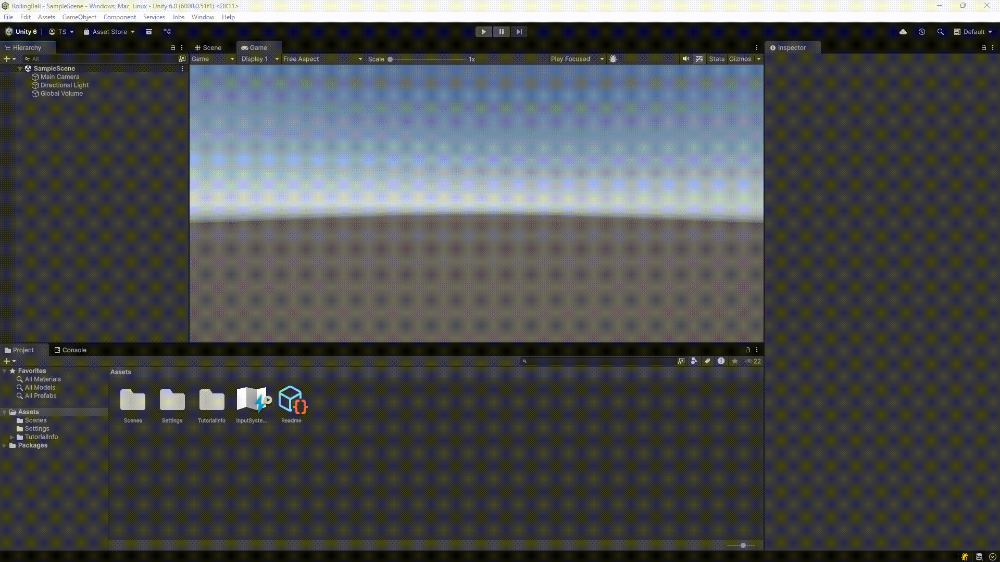

難易度: ★☆☆☆☆ 入門レベル

# 1. はじめに

* この記事は Unity 講習会 2025 の資料です.
* Unity やってみたいけど何をすればいいのかわからない人を0を1にするための講習会です.
* 2024年度版とほぼほぼ一緒です. Unity6用に書き換えちょっと修正した感じです.

## 1.1. 前提条件, 注意事項

* Unity Hub と Unity と任意の IDE (Visual studio, Rider など) をインストール済みであることを前提です.
* 本資料では Unity 6.0(6000.0.51f1) を使用します.
* Mac の人は Visual Studio は使えないことに注意してください.
* 任意のIDEが無い方は[こちら](https://tuatmcc.com/blog/UnityLec2024Step0/)の記事を読んでください.
* プログラミングは, A科の1年生が6月ぐらいまでの授業で習ったことを前提に解説が書いてあります.
* この記事では, WindowsでコードエディタにRiderを使う前提に書いています. Mac, Linuxの人, Visual Studioの人は適宜読み替えてください.

## 1.2. やる内容と学ぶ内容

玉転がしゲームを作ります. Unityでゲームを作るための基本的なことを学びます.

# 2. Unityのプロジェクトを作る

ここでは, Unityのプロジェクトを作成します.

## 2.1. Unity Hub

Unity Hubを起動します. Unity HubはUnityのプロジェクトを管理するためのツールです. Unity Hubを起動すると, プロジェクトの一覧が表示されます. 以下の写真では, 何もプロジェクトがない状態です.

左にある `Install` を開くとパソコンにインストール済みのUnity Editor本体の一覧を見ることができます.

Unity のプロジェクトを作ります. 左の `Projects` をクリックして, プロジェクト一覧に戻ってください. そして, 右上の `New Project` ボタンをクリックします.

プロジェクトの初期化画面が表示されます. 以下のように設定してください.

* 真ん中の項目はテンプレートです. `Universal 3D` を選択してください. デフォルトになっているはずです.
* 右側の `Project name` はプロジェクト名をきめる場所です. プロジェクト名は `RollingBall` としてください.
* `Location` はプロジェクトの保存場所です. デフォルトのままで大丈夫です. お好みで変更しても構いません.
* `Connect to Unity` はチェックを外してください.

設定が終わったら, 右下の `Create Project` ボタンをクリックしてください.

しばらくすると, Unityのエディタが起動します. これでプロジェクトの作成は完了です. 以下の様な画面が表示されるはずです.

## 2.2. Unity Editor のタブとレイアウト

デフォルトのレイアウトでは, 以下のタブが見えています。

|タブの名前|説明|
|---|---|
|Scene|シーンを編集する (神視点)|
|Game|レンダリングされたゲーム画面|
|Hierarchy|シーンに配置されたオブジェクトのリスト|
|Project|プロジェクトのファイル一覧 (Explorer や Finder のようなもの)|
|Inspector|選択したオブジェクトのプロパティ|
|Console|ログの表示|

タブの切り替えは, タブの右上のタブの名前の部分をクリックすることで切り替えることができます.

それぞれのタブの詳しい説明は, 実際にゲームを作りながら説明していきます.

# 3. オブジェクトを配置する
